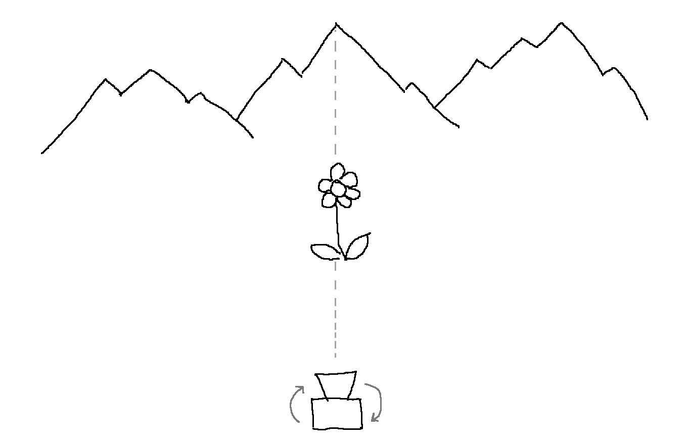
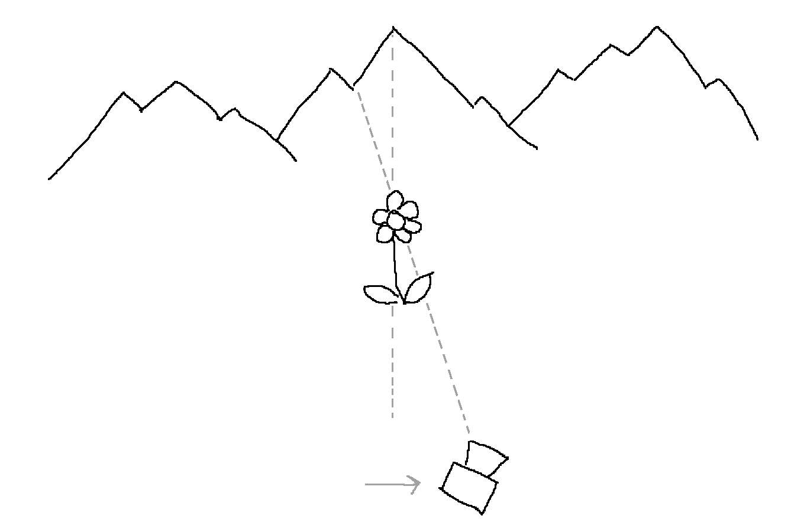
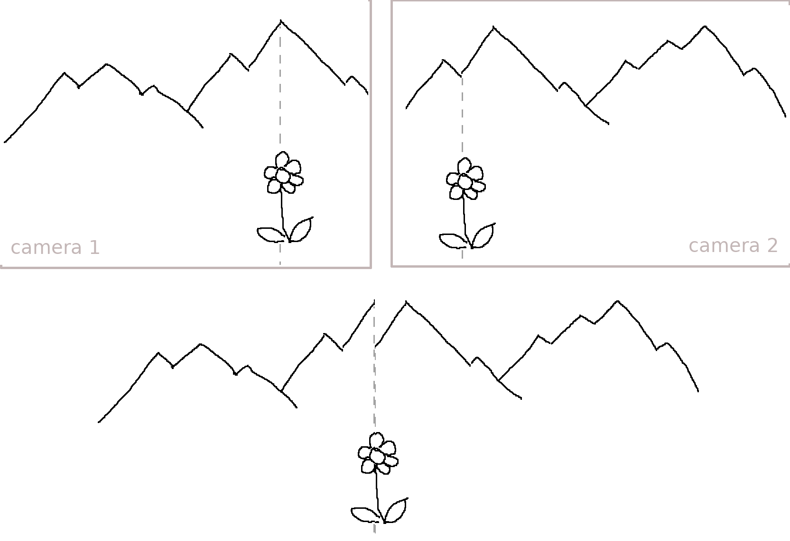
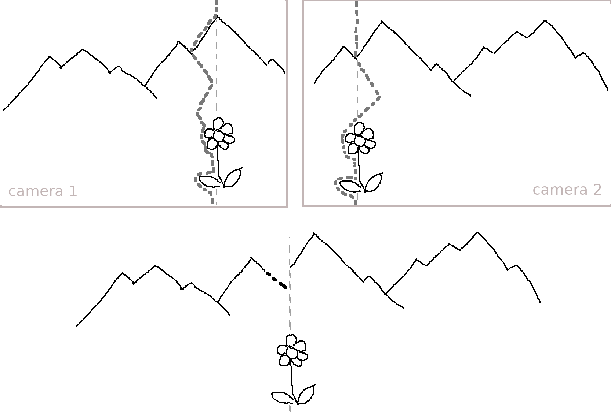
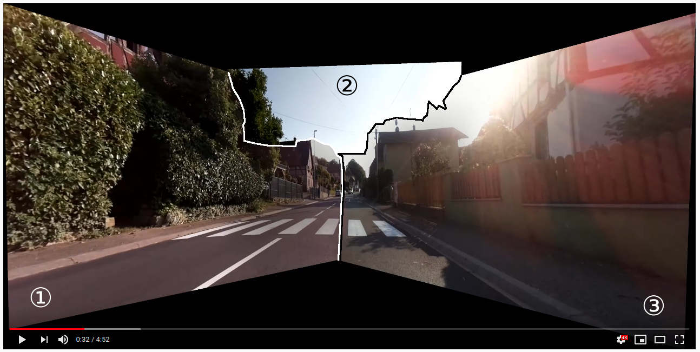

# Stitching
> *Work in progress*

## A flower and a mountain

Let's imagine we want to make a panoramic picture of a flower in front of a mountain...

### Camera rotation only

If the camera is only rotated and not translated, the flower stays aligned with the mountain summit in background. Stitching will work at every distances.

### Camera rotation and translation

If the camera is translated, the flower will not remain aligned with the mountain summit. Stitching will only work at a given distance.

Result: a very visible seam is created on the background mountain.

#### Mitigation

OpenCV's ``stitching`` sample implementation uses *graph cut*. This algorithm is originally used to find less visible seams in texture in order to repeat them *seamlessly*.

Result: the background mountain is cut in a more natural way, following its shape.

Real-life example with 3 camera:

Example video: https://www.youtube.com/watch?v=G6LT5OuDvvY

References:
 - OpenCV ``stitcher_detailed``, https://github.com/opencv/opencv/blob/master/samples/cpp/stitching_detailed.cpp
 - OpenCV ``cv::detail::GraphCutSeamFinder`` class, https://docs.opencv.org/master/db/dda/classcv_1_1detail_1_1GraphCutSeamFinder.html
 - https://slides.com/redbug312/graphcutseamfinder

Original paper:
> Vivek Kwatra, Arno Schödl, Irfan Essa, Greg Turk, and Aaron Bobick. Graphcut textures: image and video synthesis using graph cuts. In ACM Transactions on Graphics (ToG), volume 22, pages 277–286. ACM, 2003.
https://dl.acm.org/doi/10.1145/882262.882264
