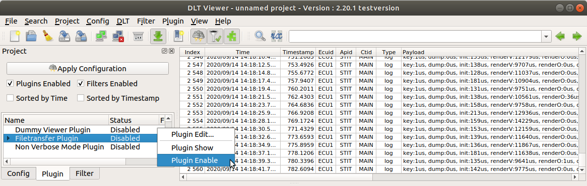
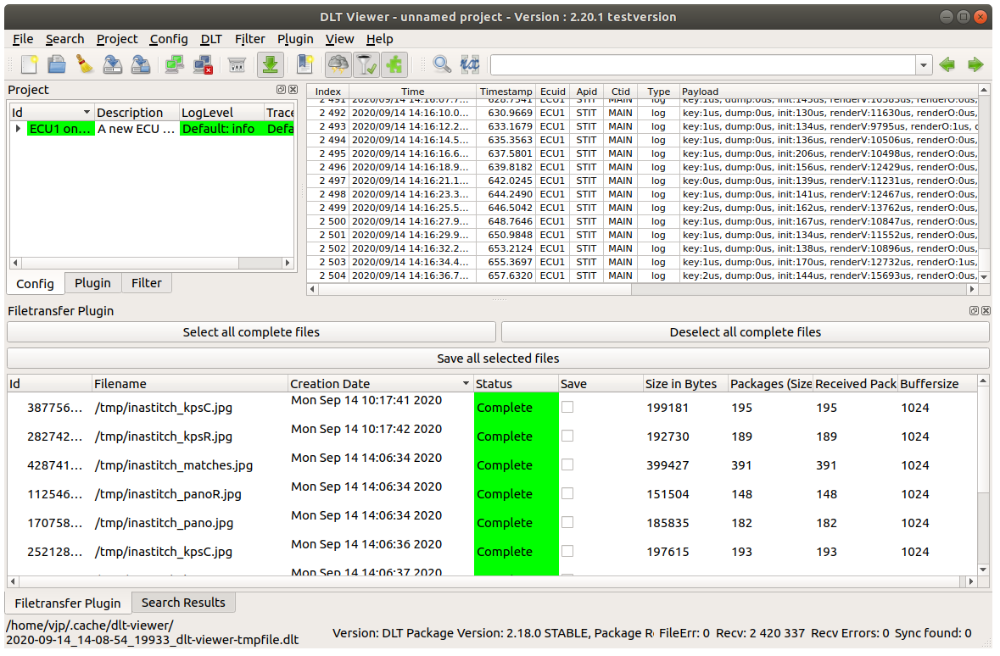
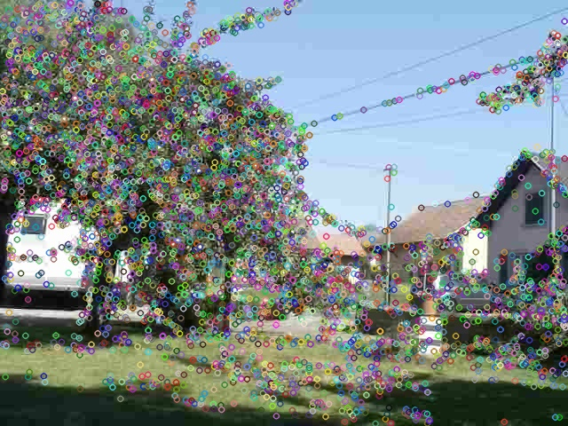
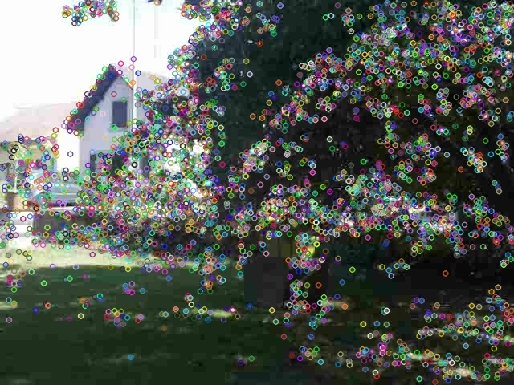
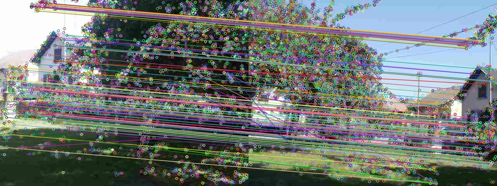
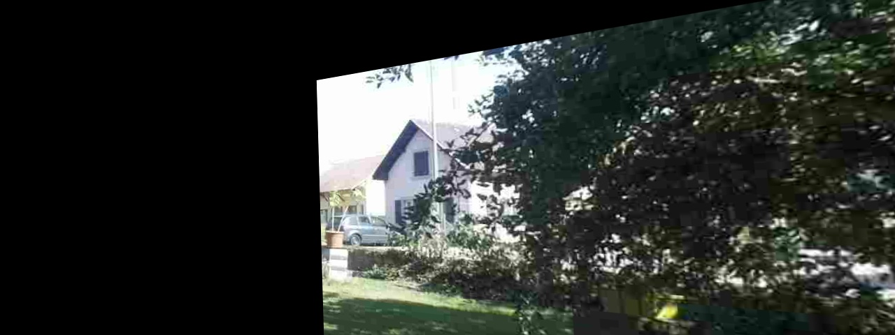
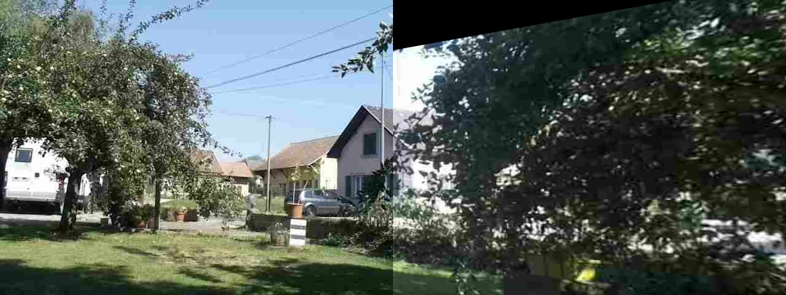
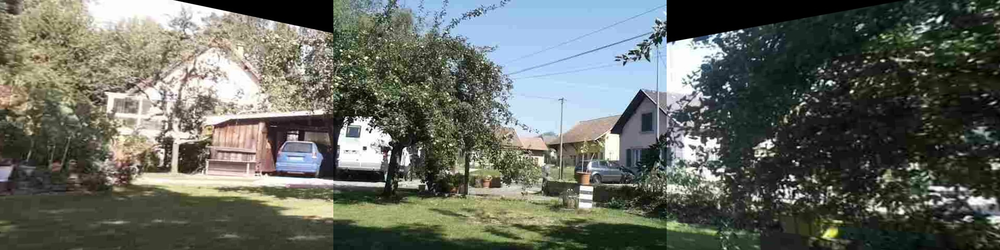

# Calibration

> This page describes ``inastitch`` calibration process, and debug possibilities.

## Get calibration pictures over DLT
Connect to the *stitcher board* with ``dlt-viewer``.

Don't forget to enable ``FileTransfer`` plug-in.

After starting a new calibration, new files should become available in the "Filetansfer Plugin" tab:

 - ``inastitch_kpsC.jpg``: "Keypoints Center", keypoints (i.e., features) of the center image with ``SIFT`` algorithm.
 - ``inastitch_kpsR.jpg``: "Keypoints Right", keypoints (i.e., features) of the right image with ``SIFT`` algorithm.
 - ``inastitch_matches.jpg``: "Matches", matches between keypoints from center and right image.
 - ``inastitch_panoR.jpg``: "Panorama Right", transformation of the right image from the point of view of the center image.
 - ``inastitch_pano.jpg``: "Panorama", center and right image stitched together.

Note: the process occurs again for the left image. Left and center image are flipped, therefore left become right image.

## What happens when I start calibration?
This is the calibration recipe.

### 1. Take current camera frame
The current *center* and *right* camera images are taken. Camera field-of-view need to overlap, and each image need to be captured at the same time.

### 2. Run ``SIFT`` to find features
``SIFT`` stands for "Scale-Invariant Feature Transform", see: https://en.wikipedia.org/wiki/Scale-invariant_feature_transform.

Features are searched in the *center* and *right* images.

Note: large areas of solid color with no details have no feature, for example the blue sky or white walls. On the other hand, trees and vegetation have many little details with each leaf becoming a feature.

> OpenCV function is ``cv::Feature2D::detectAndCompute``.

### 3. Match the similar features
Similar features between the two images are matched together.

Note1: the matches will happen where the two image overlap. It is important to choose a calibration location where details are found in the overlapping area.

Note2: a few matches a wrong.

> OpenCV function is ``cv::DescriptorMatcher::knnMatch``.

### 4. Calculate transformation matrix
A transformation matrix is calculated to best fit the matches.

The transformation matrix is applied to each pixel of the *right* image, in order to warp it into the point of view of the center image.

Note: images could be warpped into different points of view.

> OpenCV function is ``cv::findHomography`` and ``cv::warpPerspective``.

### 5. Merge
Because the *right* image was warpped into the point of view of the *center* image, it can be copied without transformation.

### 6. Repeat the same for the left
By applying the same calibration to the *left* image, all images can be stitched together.

## Why is calibration wrong?

*TODO*
