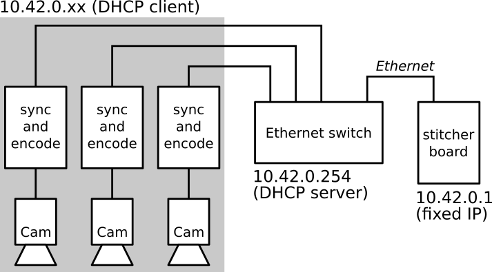
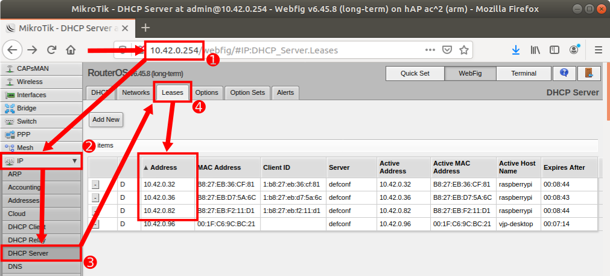
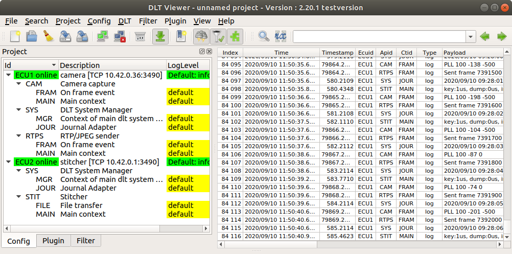

# DLT
## Overview
Each computer (camera system and stitcher) runs ``dlt-daemon``.

The stitcher board has a fixed IP address: ``10.42.0.1``.
The camera boards have IP address chosen by the DHCP server running in the Ethernet switch. Please use the web interface of the switch at: ``http://10.42.0.254`` to find the IP addresses of the camera systems.

## DHCP leases

## DLT Viewer
DLT Viewer is found at: https://github.com/GENIVI/dlt-viewer.

If you need to build ``dlt-viewer`` yourself from source, see build instructions below, otherwise skip this section.

### Build instructions for Ubuntu

    sudo apt install cmake libqt5serialport5-dev
    curl -L https://github.com/GENIVI/dlt-viewer/archive/v2.20.1.tar.gz | gunzip | tar x
    mkdir build && cd build
    cmake ../dlt-viewer-2.20.1/
    make
    ./bin/dlt-viewer

## DLT App and Context identifiers

For each ECU:
 - ``SYS`` ``JOUR``: System log from ``/var/log/syslog``.
   - Note: ``PTP`` precision is logged here.

For camera ECU:
 - ``CAM``: Modified Raspberry Pi camera tool (``raspivid``) with PLL.
   - ``MAIN``: Main logs (e.g., start-up options, software version).
   - ``FRAM``: On frame event log: PLL accuracy.
 - ``RTPS``: ``inastitch`` talker.
   - ``MAIN``: Main logs (e.g., start-up options, software version).
   - ``FRAM``: On frame event log: sent frame and timestamp.

For stitcher ECU:
 - ``STIT``: ``inastitch`` listener.
   - ``MAIN``: Main logs (e.g., start-up options, software version).
   - ``FILE``: File transfer (to be used with ``Filetransfer`` plug-in) for calibration debug images.
