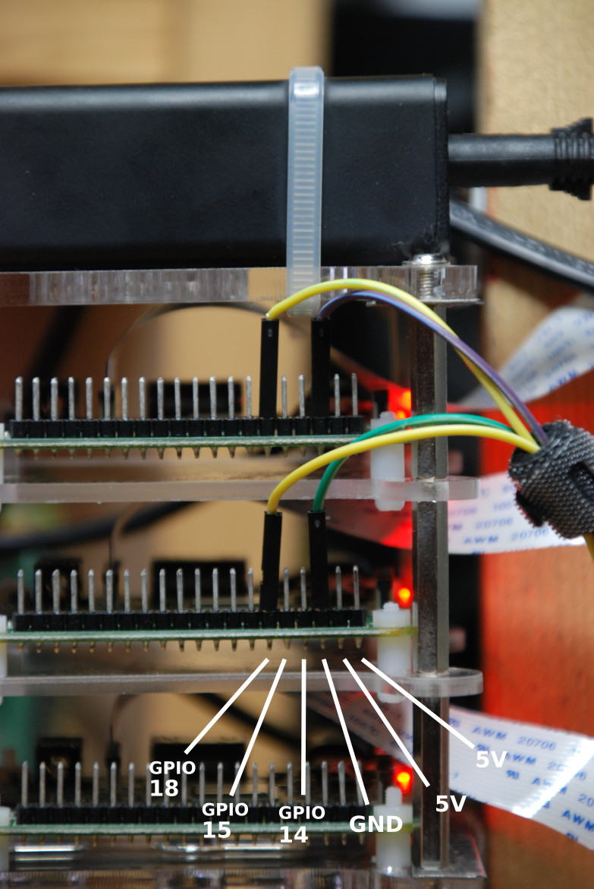
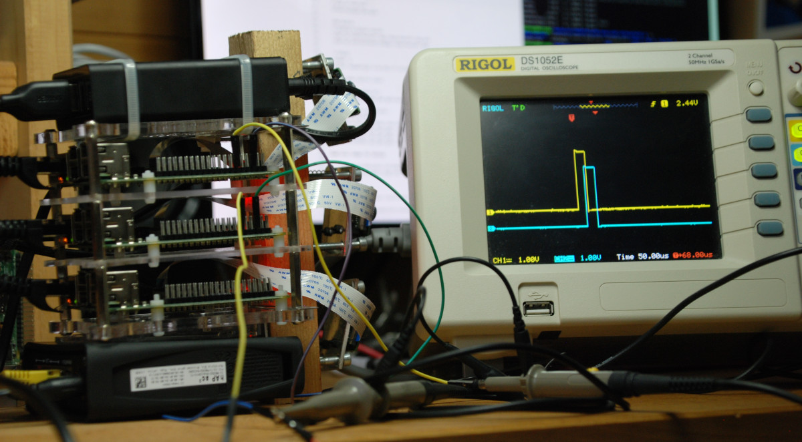

# Oscilloscope and PTP clock

It is possible to precisely measure the delay between the system clocks of the camera systems.
The linux kernel of the camera boards was modified to output a *pulse per second* (i.e., ``PPS``) on the ``GPIO 18`` pin.

## Pinout
More about Raspberry Pi GPIO: https://www.raspberrypi.org/documentation/usage/gpio/

Note: All three camera have the same pinout.
## Example
With a multi-channel oscilloscope, one can measure the delay while the system is running.

**Important notes**:
 - The pulse corresponds to the PTP clock (system clock) of the OS, not the camera trigger. The system clock is used to align camera trigger.
 - This pulse is generated using an interrupt. Since the OS is not realtime, the interrupt might be late. Watch ``dmesg`` for a warning concerning late interrupt:
   - ``[80884.667287] pps_gen_gpio: we are late this time 1599727501.999969780``
