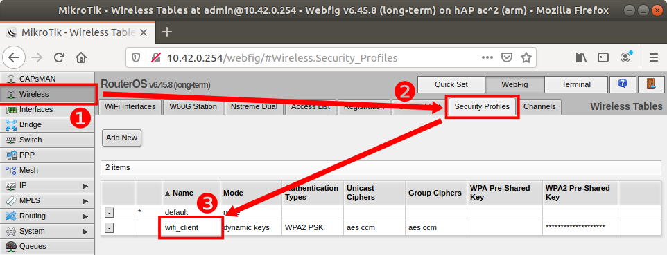
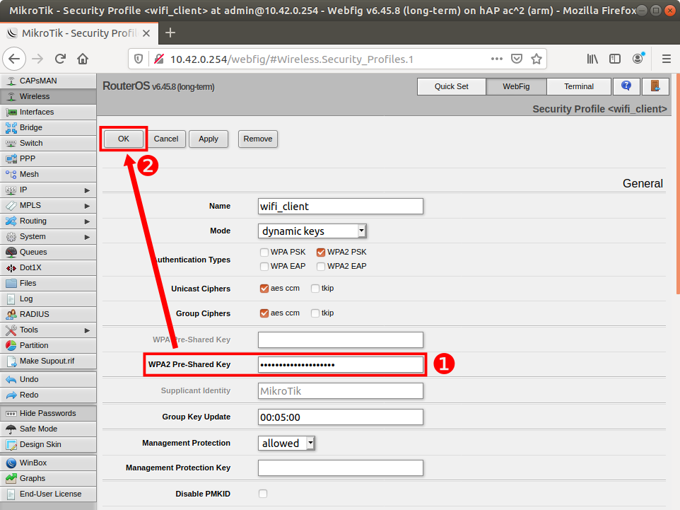
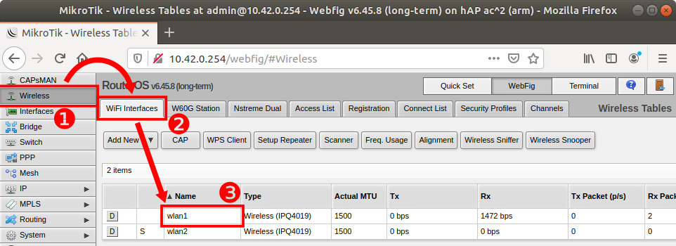
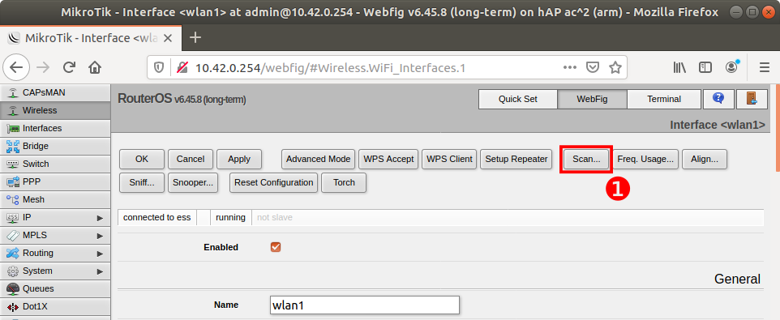
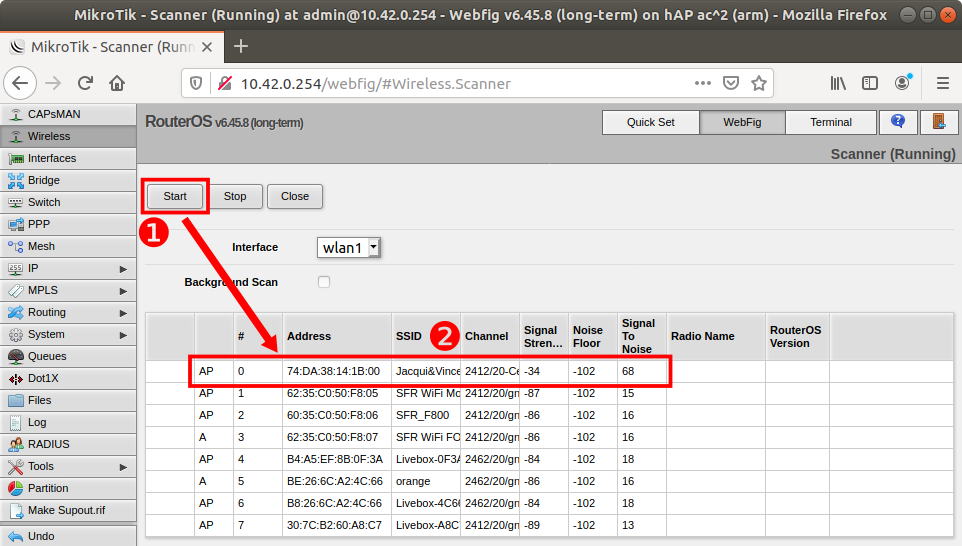
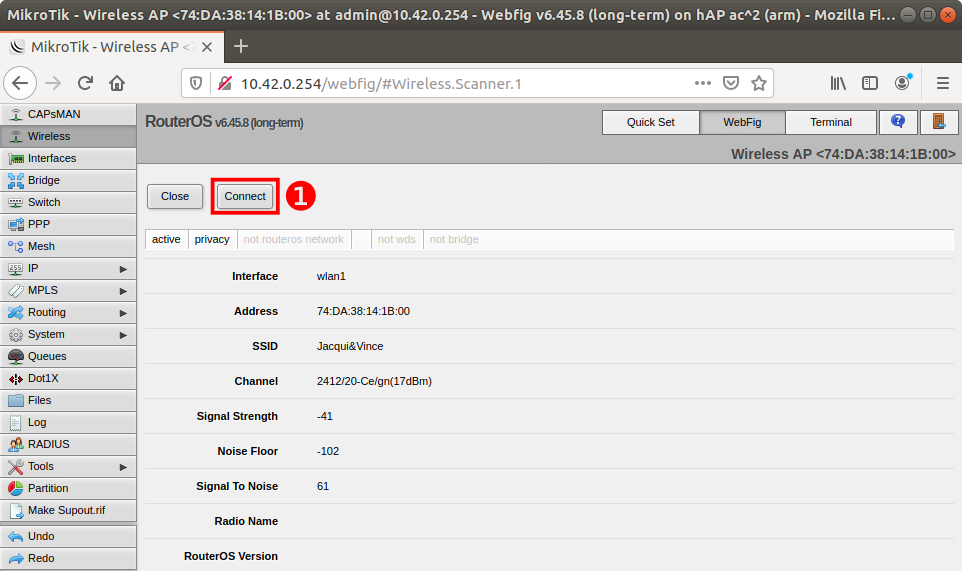
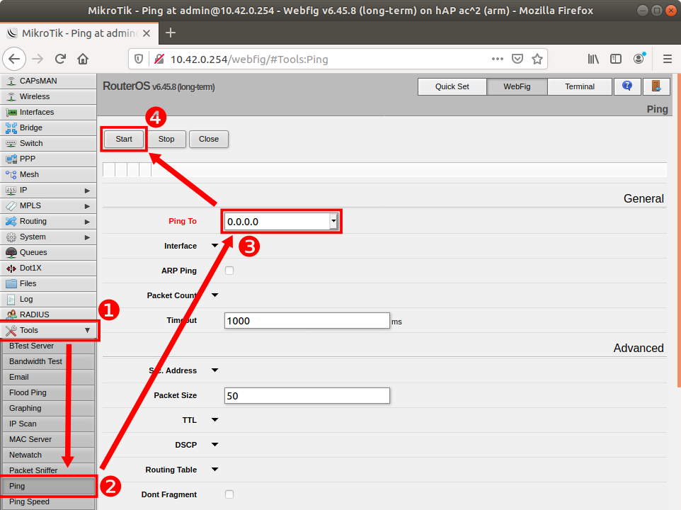

# Software update

``inastitch`` is delivered as Debian packages and can be updated.

## Setup internet access via WiFi
### Step

 1. Go to "Wireless" section
 2. "Security Profiles" tab
 3. Click "wifi_client" in the list

### Step

 1. Enter your WiFi key
 2. Click "OK" button

### Step

 1. Go to "Wireless" section
 2. "WiFi Interfaces" tab
 3. Click "wlan1" in the list

### Step

 1. Click "Scan" button

### Step

  1. Click "Start" button
  2. Click your WiFi network in the list (the one of which you gave the WiFi key in the previous steps)

### Step

 1. Click "Connect" button

### Check
You can check the internet connection from the router with the "Ping" tool:

## Update
### Automatic update
Update should occur automatically at start-up.

*TODO: DLT verification*

### Manual update
It is also possible to trigger the update from command-line.

Connect to the target you want to update using ``ssh``. For the stitcher:

    ssh pi@10.42.0.1
    # password: inatech
    
    sudo apt update
    sudo apt install inastitch

For the camera:

    ssh pi@10.42.0.32
    # password: inatech
    
    sudo apt update
    sudo apt install inartpsend

## Repository
``inastitch`` may work on other targets.

Add **one** of these lines to ``/etc/apt/source:list``, depending on your CPU architecture:

    # ARM 32-bit
    deb [trusted=yes] http://vjordan.info/repo/inastitch/armhf ./
    
    # ARM 64-bit
    deb [trusted=yes] http://vjordan.info/repo/inastitch/arm64 ./
    
### Tested targets
 - Nvidia Jetson Nano, running Ubuntu 18.04
