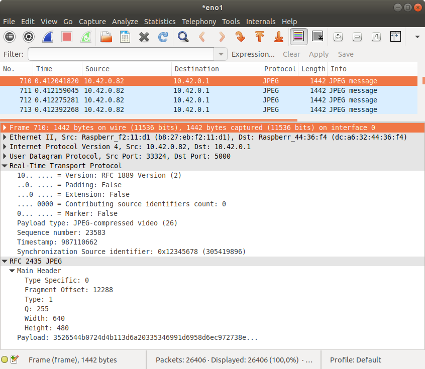
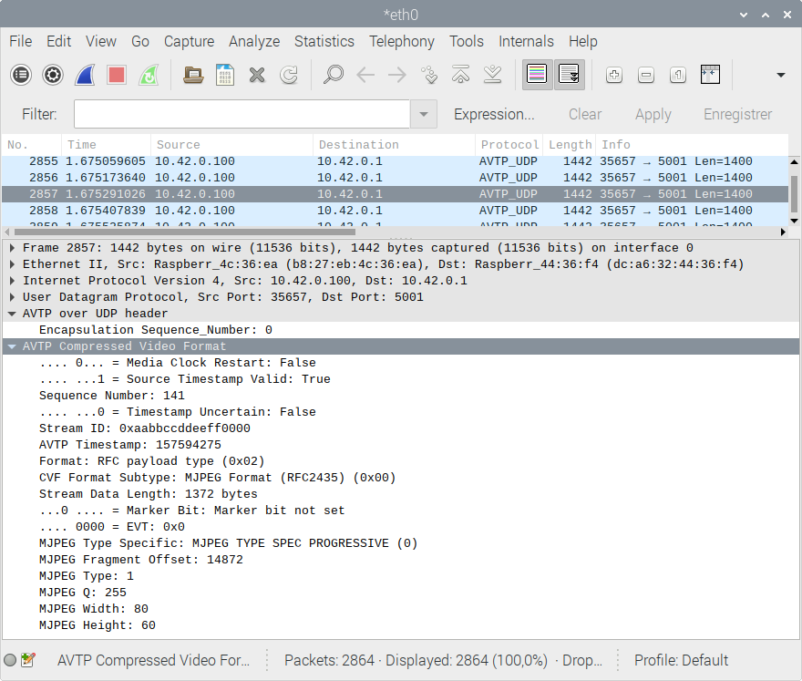

# WireShark and port mirroring
## Introduction
Ethernet traffic can be analyzed with WireShark. The network traffic of one switch port can be mirrored on another port.
It is then convenient to connect a laptop to a free switch port and capture the traffic.

## Mikrotik switch config
Via the web-interface, go to "Terminal" (see *top-right* corner), and type the following command to copy all the traffic from ``ether4`` onto ``ether1``:

    /interface ethernet switch
    set switch1 mirror-source=ether4 mirror-target=ether1

## WireShark
This is an example of traffic from a camera streaming ``RTP/JPEG``. WireShark has a built-in plug-in for this protocol. On a ``UDP`` frame, right-click and select "Decode As", and "RTP" in the list.

### WireShark and AVTP
For camera in ``AVTP`` mode, it is a bit more complex.

While WireShark has a built-in frame dissector for ``IEEE1722/AVTP`` (aka, "Raw" ``AVTP``), it has no support for ``AVTP`` inside ``UDP``. The camera streams ``UDP/AVTP``.

This section describes how to write a Lua script to call back the original ``AVTP`` dissector in ``UDP`` frames.

#### WireShark and Lua dissector
Lua script:

    print("Loading AVTP/UDP dissector...")
    print("Found AVTP CVF dissector?")
    print((DissectorTable.get("ieee1722.subtype"):get_dissector(3)))

    -- declare our protocol
    trivial_proto = Proto("AVTP_UDP","AVTP on UDP")
    -- create a function to dissect it
    function trivial_proto.dissector(buffer,pinfo,tree)
        pinfo.cols.protocol = "AVTP_UDP"
        local subtree = tree:add(trivial_proto,buffer(),"AVTP over UDP header")
        subtree:add(buffer(0,4),"Encapsulation Sequence Number: " .. buffer(0,4):uint())

        -- "AVTP Compressed Video Format"
        local avtp_cvf_dissector = DissectorTable.get("ieee1722.subtype"):get_dissector(3)
        avtp_cvf_dissector:call(buffer(4):tvb(), pinfo, tree)
    end
    -- load the udp.port table
    udp_table = DissectorTable.get("udp.port")
    -- register our protocol to handle udp port 5000
    udp_table:add(5000,trivial_proto)

Note: in the script above, the default ``UDP`` port for our dissector is set to ``5000``, but this can be overwritten with *right-click* and "Decode As". The dissector will appear as ``AVTP_UDP`` in the list.

References:
 - WireShark Lua API reference: https://www.wireshark.org/docs/wsdg_html_chunked/wsluarm_modules.html
 - Lua API releated to Proto and Dissector: https://www.wireshark.org/docs/wsdg_html_chunked/lua_module_Proto.html

To run WireShark with the Lua script:
    
    # write the script to 'dissector.lua'
    wireshark-gtk -X lua_script:dissector.lua

