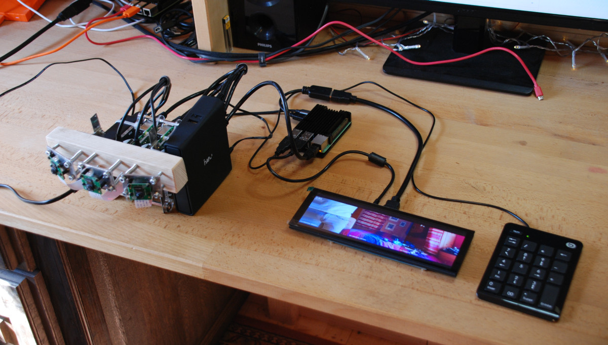
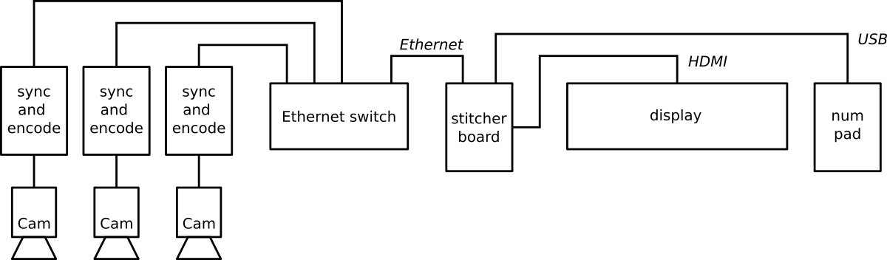
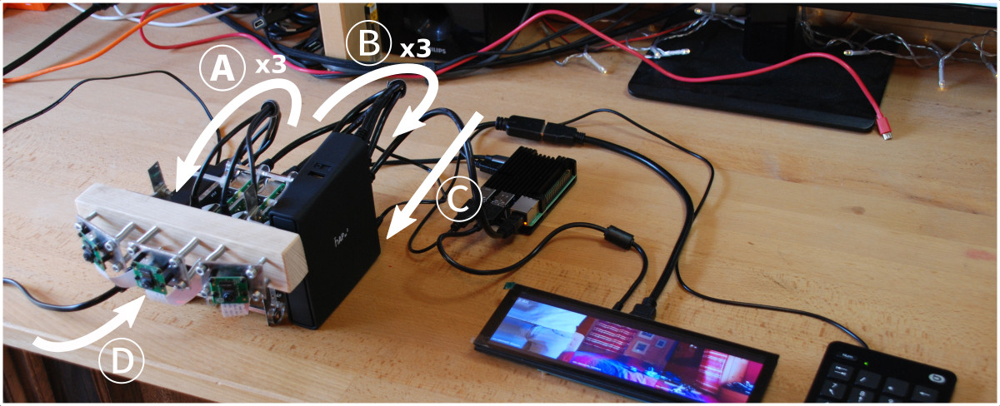
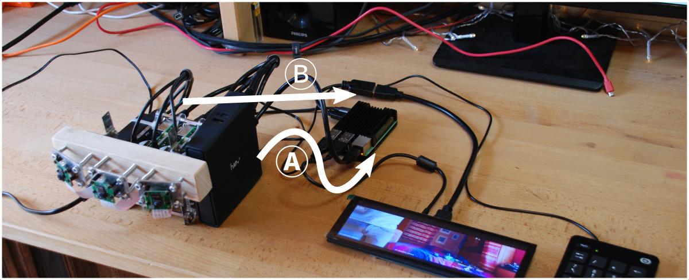
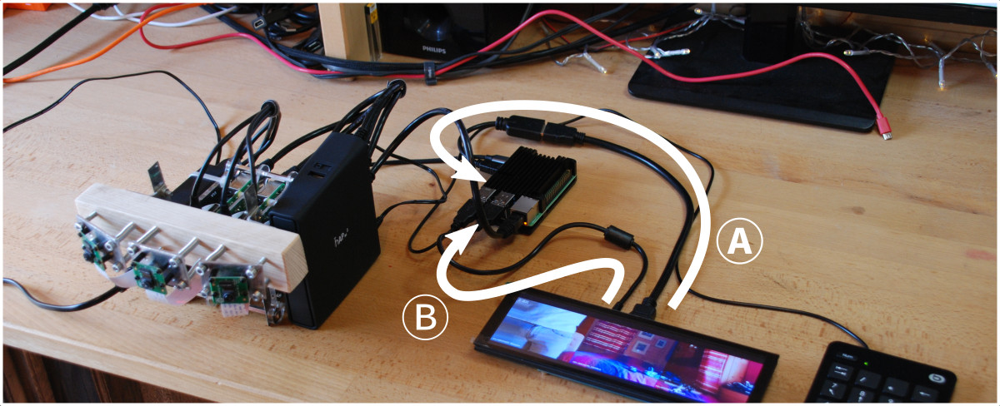
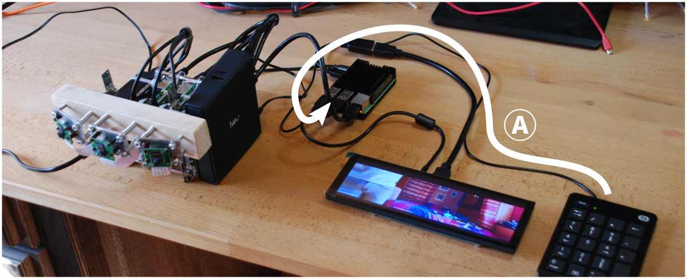
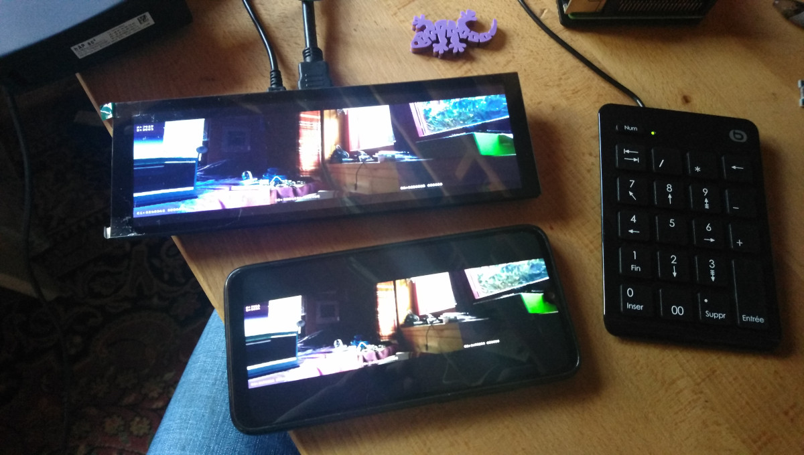

# Quick start
## Introduction
This page describes how to connect together the different parts of the ``inasitch`` demo.

This is the final result:

### Shipping content
The demonstration hardware is made of:
 - 3 [Raspberry Pi](https://www.raspberrypi.org) 3 single-board computers and 3 camera
 - 1 [Mikrotik](https://mikrotik.com) switch/router
 - 1 [Raspberry Pi](https://www.raspberrypi.org) 4 single-board computer for the stitcher
 - 1 HDMI 8" wide screen
 - 1 USB numpad

You should also have received:
 - 1 HDMI dongle

## 3-camera system

Power and network cables were disconnected to prevent any connector damage during shipping.

### Power
**(A)** connect each of the 3 Raspberry Pi to the USB power adapter.

### Network
**(B)** connect each of the 3 Raspberry Pi to the Ethernet switch.

### Mains
- **(C)** connect the Ethernet switch to mains (100-240V).
- **(D)** connect the USB power adapter to mains (100-240V).

## Stitcher board and display
### Stitcher

- **(A)** connect the stitcher Ethernet to the switch.
- **(B)** connect the stitcher USB-C power input to the USB power adapter.

### Display

- **(A)** connect the HDMI cable to the stitcher using the adapter.
  - Note: the stitcher has 2 HDMI outputs, it does not matter which is used, as long as only one is used.
- **(B)** connect USB power to the stitcher or the USB power adapter.
  - Note: the display board has two micro-USB connector: be careful to the connec the one for USB power.

### Numpad

 - **(A)** connect the USB cable to the stitcher.

Numpad keys:
 - ``Enter`` (Entrée): run OpenCV calibration with current video frames to make new transformation
 - ``Backspace`` (<-): reload saved transformation
 - ``Star`` (\*): save current transformation
 - ``Slash`` (/): no transformation
 - ``Zero`` (0): Pause/Unpause
 - ``One`` (1): Enable/disable overlay

## Smartphone and VLC
The Ethernet switch includes a WiFi hotspot. Connect to the SSID ``InatechDemo`` on 5G WiFi (there is no password). Once connected, open the following link with Android VLC:

    rtsp://10.42.0.1:8554/inastitch

**Note**: The delay of the stream displayed in VLC is caused by VLC which is buffering 1000ms of video by default.
