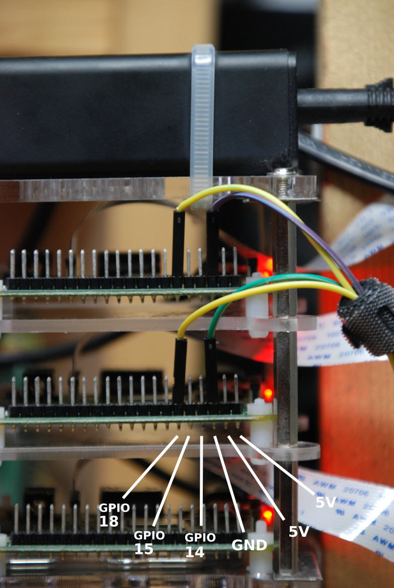
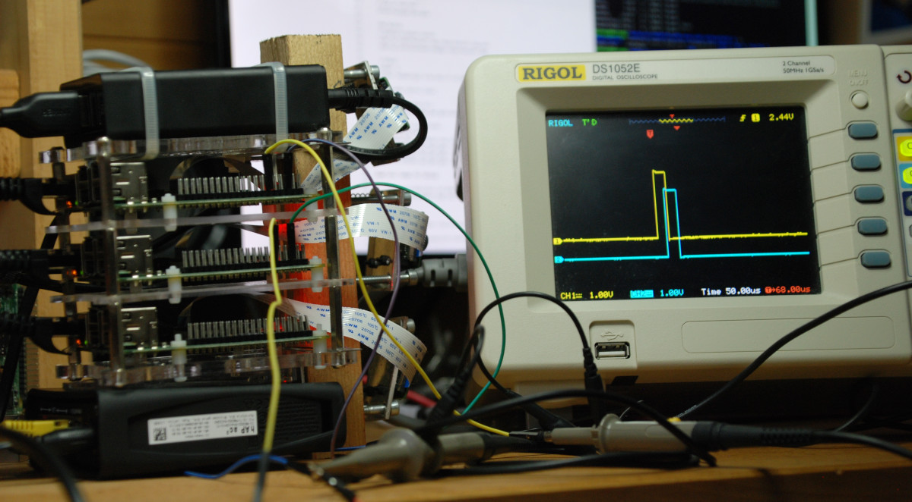

# Quick start
## Introduction
This page describes how to connect together the different parts of the ``inasitch`` demo.

This is the final result:

### Shipping content
The demonstration hardware is made of:
 - 3 [Raspberry Pi](https://www.raspberrypi.org) 3 single-board computers and 3 camera
 - 1 [Mikrotik](https://mikrotik.com) switch/router
 - 1 [Raspberry Pi](https://www.raspberrypi.org) 4 single-board computer for the stitcher
 - 1 HDMI 8" wide screen
 - 1 USB numpad

You should also have received:
 - 1 HDMI dongle

## 3-camera system

Power and network cables were disconnected to prevent any connector damage during shipping.

### Power
**(A)** connect each of the 3 Raspberry Pi to the USB power adapter.

### Network
**(B)** connect each of the 3 Raspberry Pi to the Ethernet switch.

### Mains
- **(C)** connect the Ethernet switch to mains (100-240V).
- **(D)** connect the USB power adapter to mains (100-240V).

## Stitcher board and display
### Stitcher

- **(A)** connect the stitcher Ethernet to the switch.
- **(B)** connect the stitcher USB-C power input to the USB power adapter.

### Display

- **(A)** connect the HDMI cable to the stitcher using the adapter.
  - Note: the stitcher has 2 HDMI outputs, it does not matter which is used, as long as only one is used.
- **(B)** connect USB power to the stitcher or the USB power adapter.
  - Note: the display board has two micro-USB connector: be careful to the connec the one for USB power.

### Numpad

 - **(A)** connect the USB cable to the stitcher.

## Other possible connections
### Smartphone and VLC
The Ethernet switch includes a WiFi hotspot. Connect to the SSID ``InatechDemo`` on 5G WiFi (there is no password). Once connected, open the following link with Android VLC:

    rtsp://10.42.0.1:8554/inastitch

### Laptop and DLT
Each computer (camera system and stitcher) runs a DLT daemon.

The stitcher board has a fixed IP address: ``10.42.0.1``.
The camera boards have IP address chosen by the DHCP server running is the Ethernet switch. Please use the web interface of the switch at: ``http://10.42.0.254`` to find the IP addresses of the camera systems.

### Oscilloscope and PTP clock
It is possible measure the delay between the system clocks of the camera systems. The linux kernel was modified to output a *pulse per second* (i.e., ``PPS``) on the ``GPIO 18`` pin.

More about Raspberry Pi GPIO: https://www.raspberrypi.org/documentation/usage/gpio/

With a multi-channel oscilloscope, one can measure the delay while the system is running.

Important note: the pulse corresponds to the PTP clock (system clock) of the OS, not the camera trigger. The system clock is used to align camera trigger. This pulse is generated using an interrupt. Since the OS is not realtime, the interrupt might be late. Watch syslog over DLT for a warning concerning late interrupt. 
